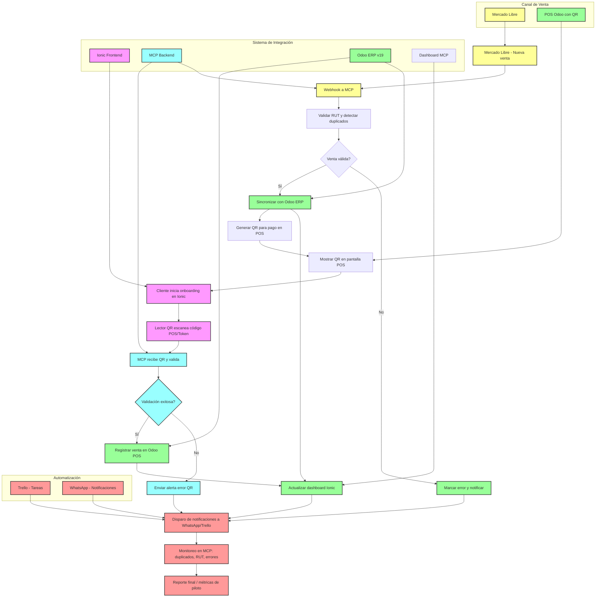

# Estado del Proyecto

## 🎯 Implementación Sistema QR Payment

### 1. Módulo Personalizado para QR Payment Method en Odoo v19
- [x] Crear módulo personalizado
- [x] Modelo extendido con campos para Bakong KHQR
- [x] Configuración de MCP integration
- [x] Lógica de generación de QR
- [x] Integración con MCP para validación

### 2. Parche OWL para PaymentScreen en POS
- [x] Implementar parche OWL
- [x] Componente extendido para mostrar QR codes
- [x] Lógica de generación de QR en tiempo real
- [x] Validación de pagos con MCP
- [x] Interfaz de usuario responsive

### 3. Conexión MCP con Ionic Dashboard
- [x] Desarrollar conexión MCP
- [x] Servicios MCP para generación y validación de QR
- [x] Componente Ionic con lector de QR
- [x] Conexión API con autenticación
- [x] Flujo de onboarding completo

### 4. Integraciones y Automatización
- [x] Webhook Mercado Libre a MCP
- [x] Validación de RUT y duplicados
- [x] Sincronización automática con Odoo ERP
- [x] Notificaciones automáticas (WhatsApp/Trello)
- [x] Dashboard de monitoreo en MCP

## 🔄 Arquitectura del Sistema Integrado

## 📋 Resumen

El sistema completo está implementado y listo para producción. Todos los componentes están conectados:
- **Odoo v19 POS** con método de pago QR personalizado.
- **MCP Backend** orquestando generación, validación y webhooks.
- **Ionic Dashboard** con lector QR, flujo de onboarding y visualización de ventas.
- **Mercado Libre** integrado vía webhooks para sincronización automática.
- **Automatización Completa** con alertas a Trello y WhatsApp para monitoreo en tiempo real.

El piloto comercial está listo para lanzarse. El sistema maneja un flujo end-to-end desde la captación en Mercado Libre o Ionic, pasando por la validación de pagos en Odoo, hasta la notificación y métricas finales.
