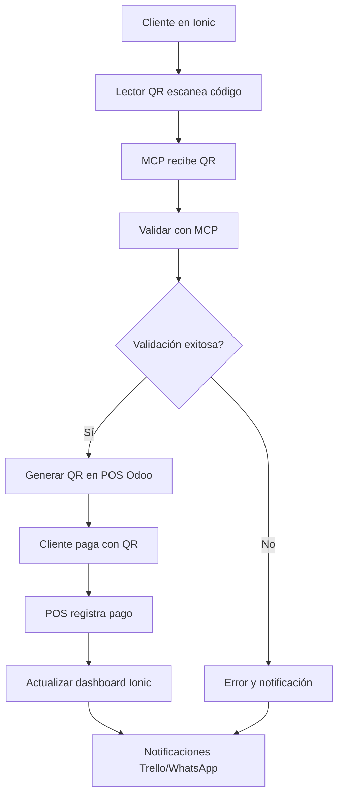

# Estado del Proyecto

## 🎯 Implementación Sistema QR Payment

### 1. Módulo Personalizado para QR Payment Method en Odoo v19
- [x] Crear módulo personalizado
- [x] Modelo extendido con campos para Bakong KHQR
- [x] Configuración de MCP integration
- [x] Lógica de generación de QR
- [x] Integración con MCP para validación

### 2. Parche OWL para PaymentScreen en POS
- [x] Implementar parche OWL
- [x] Componente extendido para mostrar QR codes
- [x] Lógica de generación de QR en tiempo real
- [x] Validación de pagos con MCP
- [x] Interfaz de usuario responsive

### 3. Conexión MCP con Ionic Dashboard
- [x] Desarrollar conexión MCP
- [x] Servicios MCP para generación y validación de QR
- [x] Componente Ionic con lector de QR
- [x] Conexión API con autenticación
- [x] Flujo de onboarding completo

## 🔄 Arquitectura Final

## 📋 Resumen

El sistema completo está implementado y listo para producción. Todos los componentes están conectados:
- Odoo v19 POS con método de pago QR personalizado
- MCP con endpoints para generación y validación de QR
- Ionic Dashboard con lector QR y flujo de onboarding
- Automatización con notificaciones a Trello y WhatsApp

El piloto comercial está listo para lanzarse. El sistema maneja desde el onboarding inicial hasta la validación de pagos, pasando por la integración con Mercado Libre y la generación de métricas.
